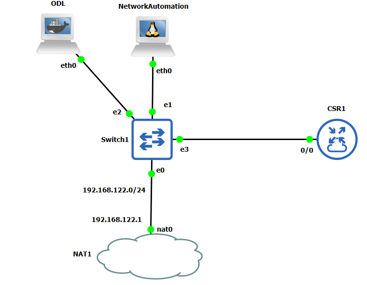

## 1. Building the topology
The initial topology in GNS3 is as follows:



### 1.1. Configure CSR1
- The CSR1 using Cisco IOS XE version 16.7.1.
- Base configuration:
```bash
conf t
hostname A-R
vrf definition MGMT
add ipv4
end
## set int f1 as MGMT interface
conf t
int g1
vrf forwarding MGMT
ip address 192.168.122.71 255.255.255.0
end
## add the default root, name-server
conf t
ip route vrf MGMT 0.0.0.0 0.0.0.0 192.168.122.1
ip domain-lookup
ip name-server vrf MGMT 192.168.122.1
end
```

- Check the connection:
```bash
ping vrf MGMT 192.168.122.1
ping vrf MGMT cisco.com
```
- Configure ssh:
```bash
conf t
crypto key generate rsa mod 2048
username admin privilege 15 password admin
line vty 0 15
transport input all
login local
end
```

- Enable netconf
```bash
conf t
netconf-yang
```
- Check the netconf process:
```bash
sh platform software yang-management process
```
- Turn of `service config`:
```bash
conf t
no service config
```
### 1.2. Configure network-automation container
- Check ssh connection from network-automation container:
```bash
ssh admin@192.168.122.71 # password: admin
```